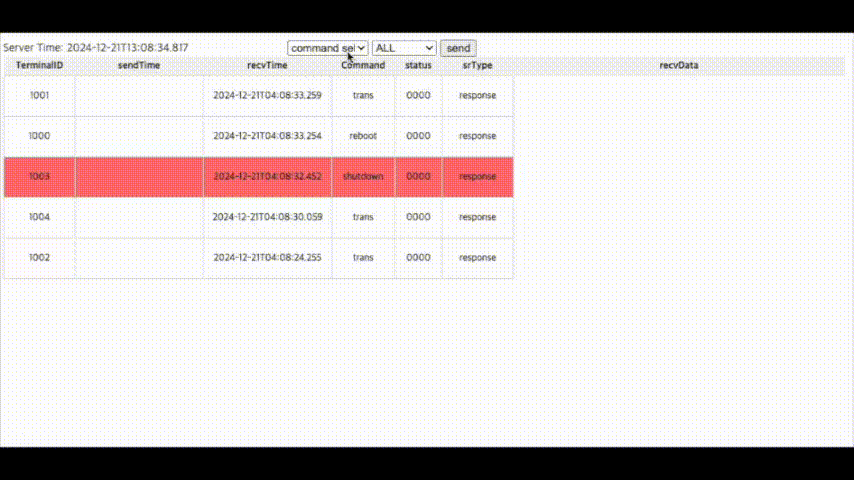

# Gateway
* postgresql notify를 이용한 메세지 큐 통신
* netty, websocket을 이용한 서버-클라이언트 통신


## demo
* http://eahn.kr:9999/swagger-ui/index.html
* http://eahn.kr:9999/actuator/prometheus
* http://eahn.kr:9999/monitor/list



# README
### [gateway](gateway/README.md)
### [gateway-client](gateway-client/README.md)
* 1개 프로젝트로 되어 있지만 디버깅을 쉽게 하려면 gateway, gateway-client 각각 intellij에서 열어서 실행하면 됨

## 워크플로우


## 개요
* web socket을 이용한 서버-클라이언트 통신
  * client --> /api/token : tomcat 접속을 위한 
* netty를 이용한 서버-클라이언트 통신
  * netty: 8090
* postgresql notify를 이용한 서버간 통신
  * postgresql: 5432
```text
 서버구간 통신을 직접하는 방법, Message Queue를 이용하는 방법이 있으나 별도의 브로커가 필요할 수 있다.
 시스템에서 빠지지 않는 것이 Database이므로 postgresql에서 지원하는 Notify를 이용하는 방법을 사용한다.
 https://www.postgresql.org/docs/current/sql-notify.html
```

## 프로젝트 구성
* gateway : http, websocket, netty(socket)
* gateway-client : netty(socket)


## 개발환경
* JDK 1.8
* Spring boot 2.4.0
* PostgreSQL 9.6 이상, 단 11 이상 권장하며 아래 트리거에서 PROCEDURE 대신 FUNCTION을 사용해야 함
  * [table.sql](gateway/src/main/resources/sql/table.sql)
```sql
--Postgresql 11 이상은 EXECUTE FUNCTION을 사용해야 함, 10 이하는 EXECUTE PROCEDURE
DROP TRIGGER IF EXISTS mq_server_notify_trigger ON mq_server;
CREATE TRIGGER mq_server_notify_trigger
    AFTER INSERT OR UPDATE ON mq_server
    FOR EACH ROW EXECUTE FUNCTION fn_mq_server_notify_trigger();
```


## Active profile
* gateway: local


## Build
* 메이븐 프로젝트 빌드
```
mvn clean package -pl gateway -am -DskipTests
mvn clean package -pl gateway-client -am -DskipTests
```

### run server
* 암호화키: JasyptEncryptionExample.java 참조, application.yml에서 ENC()로 암호화
* server.sh
```shell
#!/bin/sh
APP_NAME=gateway-1.0.0.jar
PID=$(ps -ef | grep $APP_NAME | grep -v grep | awk '{print $2}')
if [ -z "$PID" ]; then
    echo "Application is not running."
else
    echo "Killing application with PID: $PID"
    kill -9 $PID
    echo "Application terminated."
fi

echo "Start Server application"
nohup /usr/lib/jvm/java-11-openjdk-amd64/bin/java -Dgateway -jar -Dspring.profiles.active=local -Xms128m -Xmx128m -Djava.net.preferIPv4Stack=true -Duser.timezone=Asia/Seoul -Djasypt.encryptor.password=암호화키 $APP_NAME > /dev/null 2>&1 &
```

### run test client
* table.sql에 있는 사용자수 만큼 실행
* client.sh
```shell
#!/bin/sh
APP_NAME=gateway-client-1.0.jar
PID=$(ps -ef | grep $APP_NAME | grep -v grep | awk '{print $2}')
if [ -z "$PID" ]; then
    echo "Application is not running."
else
    echo "Killing application with PID: $PID"
    kill -9 $PID
    echo "Application terminated."
fi

echo "Start Server application"
nohup /usr/lib/jvm/java-11-openjdk-amd64/bin/java -jar -Xms64m -Xmx64m $APP_NAME 5 > /dev/null 2>&1 &
```

### run test
```shell
ubuntu@ip:~/apps/tomcat-ws-netty$ ls -l
-rwxrwxr-x 1 ubuntu ubuntu      412 Nov 28 11:20 client.sh
-rw-rw-r-- 1 ubuntu ubuntu 64892851 Dec 21 13:44 gateway-1.0.0.jar
-rw-rw-r-- 1 ubuntu ubuntu 15266236 Nov 28 10:41 gateway-client-1.0.jar
drwxrwxr-x 2 ubuntu ubuntu     4096 Dec 21 16:28 logs
-rwxrwxr-x 1 ubuntu ubuntu      558 Nov 28 11:28 server.sh
```

### connect url
* http://localhost:9999/swagger-ui/index.html
* http://localhost:9999/monitor/list
* http://localhost:9999/actuator/prometheus

