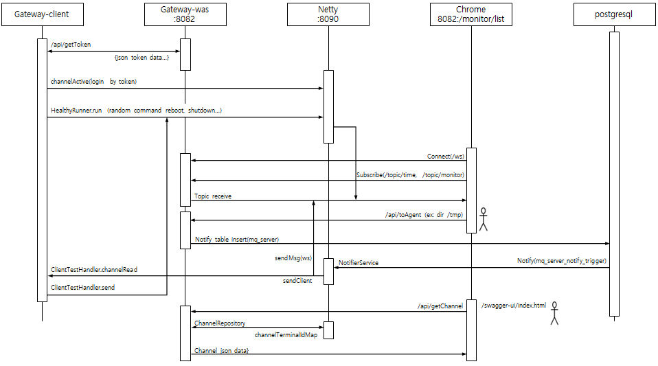

# Gateway
```text
다음 버전은 클라이언트 장치로 RTOS를 만들어서 사용해보고 싶음..... 
```

# README
### [gateway](gateway/README.md)
### [test-client](test-client/README.md)


## 워크플로우
* [workflow.drawio](doc/workflow.drawio)

{width="600px"}


## connect url
* http://localhost:8082/swagger-ui/index.html
* http://localhost:8082/monitor/list
* http://localhost:8082/actuator/prometheus

 
## 개요
* web socket을 이용한 서버-클라이언트 통신
  * client --> /api/token : tomcat 접속을 위한 
* netty를 이용한 서버-클라이언트 통신
  * netty: 8090
* postgresql notify를 이용한 서버간 통신
  * postgresql: 5432
```text
 서버구간 통신을 직접하는 방법, Message Queue를 이용하는 방법이 있으나 별도의 브로커가 필요할 수 있다.
 시스템에서 빠지지 않는 것이 Database이므로 postgresql에서 지원하는 Notify를 이용하는 방법을 사용한다.
 https://www.postgresql.org/docs/current/sql-notify.html
```

## 프로젝트 구성
- gateway : http, netty(socket)
- test-client : netty(socket)

## 개발환경
* JDK 1.8
* Spring boot 2.4.0
* PostgreSQL 9.6 이상, 단 11 이상 권장하며 아래 트리거에서 PROCEDURE 대신 FUNCTION을 사용해야 함
  * [table.sql](gateway/src/main/resources/sql/table.sql)
```sql
--Postgresql 11 이상은 EXECUTE FUNCTION을 사용해야 함
DROP TRIGGER IF EXISTS mq_server_notify_trigger ON mq_server;
CREATE TRIGGER mq_server_notify_trigger
    AFTER INSERT OR UPDATE ON mq_server
    FOR EACH ROW EXECUTE PROCEDURE fn_mq_server_notify_trigger();
```


## Active profile
* gateway: local


## Build
- 메이븐 프로젝트 빌드
```
mvn clean package -pl gateway -am -DskipTests
mvn clean package -pl test-client -am -DskipTests
```
