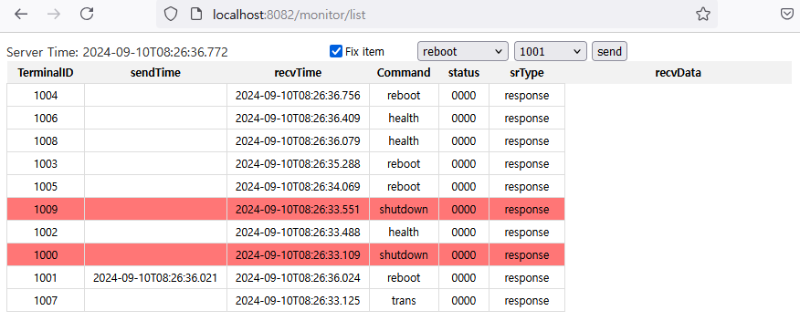

# JDK
* 11

# swagger
* http://localhost:8082/swagger-ui.html
  * http://localhost:8082/api/toAgent 서버에서 클라이언트로 전달하는 명령
```text
{"command":"reboot", "terminalId":"ALL", "script":"dir"}
```

# Postgresql
## version
* 9.6 이상 사용가능하며, 11이상은 아래 trigger에서 EXECUTE PROCEDURE 대신 <span style='red'>**EXECUTE FUNCTION**</span> 사용해야 함
```text
DROP TRIGGER IF EXISTS mq_server_notify_trigger ON mq_server;
CREATE TRIGGER mq_server_notify_trigger
    AFTER INSERT OR UPDATE ON mq_server
    FOR EACH ROW EXECUTE PROCEDURE fn_mq_server_notify_trigger();
```

## Database & Table
* Table create: [src/main/resource/sql/table.sql](src/main/resource/sql/table.sql)
* notify sample insert
* terminalId
  * ALL: 전체 클라이언트
  * 1001: 지정된 클라이언트
```sql
--reboot, shutdown..., terminalId:ALL, 1001....
INSERT INTO public.mq_server (message, recvserver, sendserver)
VALUES ('{"command":"shutdown", "status":"0000", "terminalId":"ALL","srType":"response", "message":"hello한글", "data":{"time":"'|| now() ||'", "infoMessage":"클라이언트 이벤트를 요청합니다."}}', 'GATEWAY', 'ADMIN')
  ON CONFLICT (recvserver) DO
UPDATE SET
  datetime = now(),
  message = EXCLUDED.message,
  sendserver = EXCLUDED.sendserver;
```

# temninal Monitoring
* websocket을 이용, 클라이언트 접속시 모니터링 가능
* http://localhost:8082/monitor/list
* link [test-client](test-client)
  * 쓰레드를 이용한 실시간 모니터링 테스트 ClientTestApplication numberOfClients에서 조정할 수 있음
  * numberOfClients는 userinfo에 등록되어있어야 하며, admon0~admin9까지 등록된 사용자수까지 사용하면 됨
  * 

# websocket heartbeat
* javascript debug 로그 출력
```javascript
        //stompClient.debug = null; //로그를 사용하지 않을 경우 null, stomp 로그 비활성화
        stompClient.debug = function(str) {
            //console.log(new Date() + ' STOMP: ' + str); //stomp 로그 비활성화
            //if (str.startsWith('ERROR') || str.startsWith('WARN')) {    //필요한 로그만 출력
                console.log(str);
            //}
        };
```
* javascript websocket heartbeat 60초
```
>>> CONNECT
  accept-version:1.1,1.0
  heart-beat:60000,60000
```
* spring boot websocket heartbeat 60초
```
//WebSocketConfig.java에서 설정한 heartbeat 설정값
<<< CONNECTED
version:1.1
heart-beat:60000,60000
```

# Channel Monitor
* http://localhost:8082/api/getChannel
* channel 데이터에 '-' 정상, '!' 채널에 문제가 있는 경우
```json
[
  {
    "lastHandlerName": "NettyServiceHandler.login",
    "lastReadTime": "2024-04-30T15:29:44.478",
    "channel": "1003=[id: 0xca25a04e, L:/127.0.0.1:8090 - R:/127.0.0.1:5537]",
    "createdTime": "2024-04-30T15:29:44.481",
    "terminalId": "1003",
    "channelId": "ca25a04e",
    "lastWriteTime": "2024-04-30T15:29:44.488"
  }
]
```

# For prometheus
* http://localhost:8082/actuator/prometheus, health
* 추가검토: channel 송수신 시간 모니터링(명령어별), .... 
```text
gateway_netty_channel_lastprocessingtime{application="Gateway-netty",} 7.0
gateway_netty_channel_connections{application="Gateway-netty",} 10.0
```

# process
### GatewayApplicaion start


### ClientTestApplication start
* "%JAVA_11_HOME%\bin\java" -jar target\test-client-1.0.jar 1

### test-client
* https://test-client
* terminalId:ALL 전체 클라이언트, ID: 개별 클라이언트


## websocket


