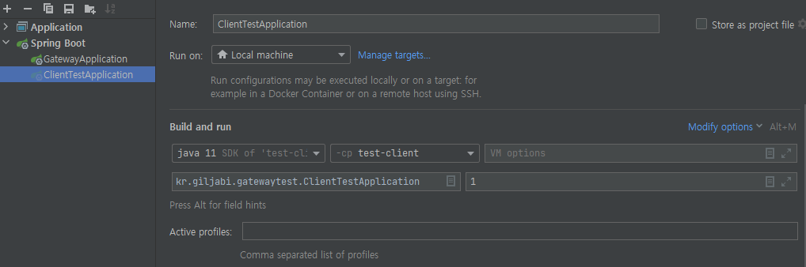

# Getting Started

## build
* jdk는 11을 사용함(HttpClient에서 11이상 기능을 사용함)
```text
mvn clean package -DskipTests -f pom.xml
```

## test 
* userinfo에 N개의 사용자가 있어야 함 --> gatweay의 table.sql 참조
```text
"%JAVA_11_HOME%\bin\java" -jar target\test-client-1.0.jar 2
```


